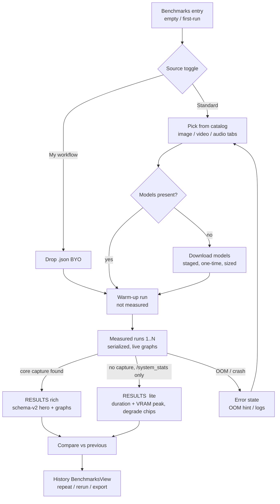

# Comfy Benchmarks — Goal 1 UX / Product Journey Spec

**Owner:** designer · **Build target:** `PerformanceTestView.vue` (+ `BenchmarksView.vue` for history/compare) · **Status:** ready to build tonight
**Grounded in:** PRD (Tuner / Evaluator / Buyer), TDD "CURRENT PLAN & SPIKE" (core is the metric engine, Desktop is a **consumer/viewer**, local-only), PR #1607 curated catalog (`assets/benchmark-templates.json`, image/video/audio), and the live `CoreBenchmarkSummary` schema-v2 type in `src/types/ipc.ts`.

This spec **supersedes the results/graphs half** of `comfy-benchmarks-goal1.md`. That doc's picker + run-phase + backend-aware VRAM copy still stands and is referenced, not repeated. What is new here: the results screen redesigned around the **rich schema-v2 capture** (`coreBenchmark`), the modality-aware hero, the graph suite, the compare view, and the graceful-degrade rules for v1 / `/system_stats`-only runs.

> Design North Star: **turn the capture into a product, not a debug dump.** One hero number the persona came for, above the fold. Everything else earns its place or hides behind a disclosure. Never fabricate a metric we did not measure — degrade honestly to a "not measured" chip.

---

## 1. Personas & the ONE number each came for

| Persona | Core question | The ONE number (hero) | Second glance |
|---|---|---|---|
| **Tuner** | "Did my change make it faster?" | **Δ vs previous run** on the hero metric (`▲ 12% faster`) | per-node op timeline (what got faster), it/s |
| **Evaluator** | "Will this run acceptably on MY GPU — and will it fit?" | **sec/image (or sec, sec/frame)** + a **fits / offloaded** VRAM verdict | VRAM peak vs total, throttled flag |
| **Buyer** | "How does my GPU compare / is it worth upgrading?" | **sec/image + it/s** with the **GPU + config chips** that make it quotable | energy (Wh), power/temp headroom |
| Power user (secondary) | "Where did the time actually go?" | per-node op timeline | per-step it/s curve, dtype/attention config |

Design consequence: the **hero band answers Evaluator + Buyer at a glance and carries the Tuner's delta**. The op-timeline is the power-user payload but sits one scroll down, above the fold on a tall window, collapsible on a short one. We do **not** make the user choose a persona — one layout serves all three by ordering.

---

## 2. The full product journey (flow)



**State inventory (every state the engineer must build a branch for):**

| State | Trigger | What shows | Primary action |
|---|---|---|---|
| Empty / first-run | no prior runs, catalog loaded | catalog cards, first preselected, results body = idle placeholder | `Run benchmark` |
| Catalog offline | manifest never cached + offline | inline notice in card area + `Retry`; toggle still works | `Retry` / switch to My workflow |
| Downloading | `modelsPresent === false` | staged download bar, size, one-time reassurance | `Stop` |
| Warm-up | run index < warmupRuns | `Warming up · run 1 of 1 (not measured)` + live graphs greyed as "priming" | `Stop` |
| Measuring (live) | measured run in progress | live VRAM / power sparkline, `run X of N`, `~mm:ss remaining` | `Stop` |
| Done — rich | terminal + `coreBenchmark != null` | full hero + graph suite (§4) | `Compare` / `Run again` / `Export` |
| Done — lite (degrade) | terminal + `coreBenchmark == null` | hero from duration + `/system_stats` VRAM peak; graphs replaced by "not measured" chips (§6) | same |
| Error — OOM | log bucket CUDA/MPS OOM | OOM copy + "try a lower-VRAM benchmark" | `Run again` / open Logs |
| Error — no runs | all measured failed | `No runs completed. See Logs.` | open Logs |

Empty / first-run / downloading / warm-up / measuring copy is unchanged from `comfy-benchmarks-goal1.md §4–5`. The rest of this doc is the **Done** and **Compare** states.

---

## 3. Modality-aware hero (the thing the persona reads first)

Modality comes from the catalog entry (`benchmark-templates.json → modality: image|video|audio`). The hero metric switches by modality; everything below the hero is shared.

| Modality | Hero (big) | Hero sub | Secondary big | Source fields | Degrade if missing |
|---|---|---|---|---|---|
| **image** | `2.14 s / image` | `median of 5 runs` | `~7.4 it/s` (steady-state) | `summary.secPerImage` or `median/imageCount`; `sampling.steadyStateItPerS` | it/s omitted (no zero) |
| **video** | `18.3 s / video` | `median of 5 runs` | `0.76 s / frame` | `median`; `sec/frame = median / frameCount` | `sec/frame` → hidden unless frameCount known; fall back to `it/s` |
| **audio** | `9.1 s` | `median of 5 runs` | `3.4× realtime` | `median`; `realtime = audioSeconds / median` | `× realtime` hidden unless audio duration known; show `s / run` |

**Honesty rules (hard):**
- `s / image` is labelled "image" only when `run.imageCount` (or catalog `imagesPerRun`) is known; else `s / run`.
- **it/s = `sampling.steadyStateItPerS`**, NOT `avgItPerS`. The schema explicitly derives steady-state by excluding the first measured step (allocator warm-up outlier). Prefix `~`. If `steadyStateItPerS == null` → omit the whole it/s line.
- `sec/frame` and `× realtime` need a denominator the capture does not always carry (frame count / audio duration). If the catalog entry does not declare it, **hide the secondary** rather than guess. Video/audio still get the top-line seconds hero, which is always real.
- Median, not mean, is the hero (reproducible; resists one slow run). Mean lives in the range sub-row for continuity.

**Hero band wireframe (image example, rich capture):**

```
┌───────────────────────────────────────────────────────────────────────────────┐
│  Qwen Image 2.1 · Text to Image   ·   RTX 5090 (32 GB)   ·   Sep 29, 2026 4:12 PM│  ← context line, muted
├─────────────────────────────────┬───────────────────────────────────────────────┤
│                                 │                                                 │
│   2.14 s / image                │   7.8 GB   VRAM peak                            │
│   median of 5 runs              │   of 32 GB · fits                              │
│   ~7.4 it/s                     │                                                 │
│                                 │                                                 │
│   ▲ 12% faster than last run    │   ⚡ 0.42 Wh / image   ·   612 W peak · 71°C     │
│                                 │                                                 │
├─────────────────────────────────┴───────────────────────────────────────────────┤
│  range 2.05–2.61 s · avg 2.22 s · 5 runs, 0 failed          (variance is the trust)│
├───────────────────────────────────────────────────────────────────────────────┤
│  [ fp8_e4m3fn ] [ sage-attn ] [ CUDA 12.8 ] [ cuDNN 9.7 ] [ NORMAL_VRAM ]         │  ← config chips
└───────────────────────────────────────────────────────────────────────────────┘
```

- Left cell = modality hero + it/s + **Tuner delta** (§5).
- Right cell = **Evaluator verdict** (VRAM fits/offloaded, backend-aware §6.3 of the prior doc) + **Buyer efficiency** line (energy + power/temp peak).
- If `resources.peak.throttled === true`, replace the calm power line with a caution: `⚠ 612 W · 84°C — thermal throttling detected` in `--danger`. Throttling is the single most decision-relevant honesty signal for a Buyer, so it is promoted into the hero, not buried.
- Config chips row (§7) makes the result **quotable and comparable** — the Buyer's whole point.

---

## 4. The graph suite (below the hero) — each visualization justified

Above-the-fold order is deliberate: **op timeline → per-step it/s → VRAM-over-time → power/temp**. Rationale: op-timeline answers "where did time go" (Tuner + power user, highest-value), it/s shows run stability, VRAM/power are context. Everything here renders from `coreBenchmark`; each has a `not measured` degrade.

All charts are **inline SVG in `<script setup>`** — no charting dep. A shared pure helper `benchmarkCharts.ts` produces `{points, path, ticks}` from a series; the template renders `<svg><polyline/><rect/></svg>`. The view already computes `coreNodeTimeline` and `coreVramSparkline` — extend that pattern.

### 4.1 Per-node op timeline — horizontal bar (P0)
- **Data:** `nodes[]` → `{classType, elapsedMs}`, sorted desc, top 10–12, bar width = `elapsedMs / max`.
- **Chart:** horizontal bars, label left, ms + % of `durations.nodeTotalMs` right.
- **Why:** the Tuner's "what got faster" and the power user's "KSampler dominates" in one glance. This is the feature that makes the capture feel like a product.
- **Degrade:** `nodes[]` empty → hide section (v1 captures may omit).

```
Where the time went                            nodeTotalMs 11.9 s
KSampler                ███████████████████████████████  9.8 s · 82%
VAEDecode               ████                             1.1 s · 9%
CLIPTextEncode          ██                               0.6 s · 5%
UNETLoader (cold)       █                                0.3 s · 3%   ← modelLoadMs, warm-run hidden
EmptyLatentImage        ▏                                0.1 s · 1%
```

### 4.2 Per-step it/s — line/area (P1, high value)
- **Data:** `sampling.perStepItPerS[]` (index-aligned, null for 0 ms steps), overlay `steadyStateItPerS` as a dashed reference line; the **first step is visually dimmed** to show it is the excluded warm-up outlier.
- **Chart:** small line chart, x = step index, y = it/s. ~72 px tall.
- **Why:** proves the number is stable (flat line = trustworthy) and visually explains *why we exclude step 1* — turns a footnote into a picture.
- **Degrade:** `< 2` non-null steps → hide.

```
it/s per step (steady-state ~7.4, dashed)
 8 ┤        ●───●───●───●───●───●───●───●
 6 ┤   (●) ╌╌╌╌╌╌╌╌╌╌╌╌╌╌╌╌╌╌╌╌╌╌╌╌╌╌╌ 7.4
 4 ┤  step1 dimmed = warm-up, excluded
   └───┴───┴───┴───┴───┴───┴───┴───┴──
     1   2   3   4   5   6   7   8
```

### 4.3 VRAM over time — area (P0)
- **Data:** `resources.series[].{tMs, vramUsedMb}`, with `device.totalVramMb` as a ceiling gridline and `device.baseline.vramUsedMb` as a floor reference.
- **Chart:** filled area, x = time, y = MB. Peak dot annotated with `resources.peak.vramUsedMb`. Ceiling line labelled `32 GB total`.
- **Why:** Evaluator sees headroom ("peaked at 7.8 of 32, comfortable"); an offload event shows as a plateau near the ceiling.
- **Degrade:** rich capture absent → use `/system_stats` sampler series if present, else render just the **peak number** with `VRAM over time — not measured` (see §6).
- **Apple / unified:** ceiling is unified memory; label `unified memory` and never draw a "VRAM budget" ceiling as if dedicated (backend-aware, per prior doc §6.3).

```
VRAM used (GB)                          peak 7.8 GB
32 ┤─────────────────────────────── total (ceiling)
   │
 8 ┤        ╭────╮      ╭─────╮  ●peak
 4 ┤   ╭────╯    ╰──────╯     ╰──
 1 ┤╌╌╌ baseline 0.9 GB
   └────────────────────────────── t →
```

### 4.4 Power & temperature — dual line (P1)
- **Data:** `resources.series[].{powerW, temperatureC}`, dual y-axis; `powerLimitW` as ceiling for power; mark throttle points where `throttled`.
- **Chart:** two lines (power in `--comfy-yellow`, temp in `--danger`-tinted), shared x = time.
- **Why:** the Buyer's "is this GPU sustaining clocks or cooking?" — the honest complement to a raw speed number.
- **Degrade:** MPS/Apple and many backends report `null` power/temp → hide the whole card (do not draw an empty axis). This is common; treat absence as normal, not error.

### 4.5 Energy (P1) — a single stat, not a chart
- **Data:** `summary.energyWhPerImage`. Rendered as the `⚡ 0.42 Wh / image` chip already in the hero. No separate chart.
- **Why:** `$/perf` and efficiency are Buyer P2 on the public site, but the local Wh number is cheap and striking now. Degrade: `null` → omit the chip.

### 4.6 Run durations bar (retained, P0)
- The existing fastest/slowest/avg/median 4-bar aggregate stays under a `Run durations` heading — it backs the range claim. Unchanged from today.

**Above vs below the fold:**
- **Above the fold (always visible on Done):** hero band, config chips, op-timeline, VRAM-over-time.
- **Behind a `Details` disclosure (collapsed by default):** per-step it/s, power/temp, run-durations bar, full System information table, per-sampler params, raw `Logs`.
- On a short window the op-timeline + VRAM cards are individually collapsible; hero is never collapsible.

---

## 5. Compare view (Tuner + Buyer)

Two modes, same component. Match rule unchanged: newest prior run with **same `benchmarkId` AND same `gpuModel`** (like-for-like).

### 5.1 Inline delta (default, in the hero)
Computed on median hero metric:
- Faster: `▲ 12% faster than last run (2.43 s)` — `--success`.
- Slower: `▼ 8% slower than last run (1.98 s)` — `--danger`.
- Within ±2%: `≈ same as last run (2.16 s)` — muted (don't cry wolf over noise).
- No prior: `First run of this benchmark — no comparison yet.` — muted.
- Prior exists, different GPU: `Last run was on a different GPU — not compared.` — muted.

### 5.2 Full compare (two runs side by side) — `Compare` action opens this
A two-column diff. Each metric shows both values + a signed delta chip. Better is always green regardless of whether lower or higher is "good" (we phrase by outcome: faster/cooler/less memory = better).

```
Compare        This run (Sep 29)          Previous (Sep 27)        Δ
──────────────────────────────────────────────────────────────────────
sec / image    2.14 s                     2.43 s                   ▲ 12% faster
it/s           7.4                        6.5                      ▲ 14%
VRAM peak      7.8 GB                     7.7 GB                   ≈ +0.1 GB
energy         0.42 Wh                    0.49 Wh                  ▲ 14% less
power peak     612 W                      598 W                    ▼ +14 W
temp peak      71°C                       69°C                     ≈ +2°C
throttled      no                         no                       —
─ config that changed ────────────────────────────────────────────────
attention      sage-attn                  pytorch                  ← changed
dtype          fp8_e4m3fn                 fp8_e4m3fn               same
```

- **Op-timeline diff (P1):** stack the two op-timelines; color bars that got faster green, slower red. This is the Tuner's dream — "my change cut KSampler 18%."
- **Config-that-changed row** auto-surfaces only chips that differ (attention, dtype, cudnn, driver, comfy version). Explains *why* the delta happened — the difference between a benchmark and a debugger.
- Delta color: `--success` better, `--danger` worse, muted within tolerance. Never both numbers colored; only the delta chip is colored.

---

## 6. Graceful degrade — "old ComfyUI without capture"

Feature-detect on `performanceTestResult.coreBenchmark`. Three tiers:

| Tier | Condition | Hero | Graphs | Chips |
|---|---|---|---|---|
| **Rich (v2)** | `coreBenchmark` present, `captureSchemaVersion >= 2` | full modality hero + it/s + energy | all §4 graphs | all §7 chips |
| **Partial (v1)** | `coreBenchmark` present, v1 | sec/image + VRAM peak; **it/s only if `steadyStateItPerS` non-null**; no energy | op-timeline + VRAM if arrays present; power/temp/per-step **hidden** | dtype/attention only if present, else omit |
| **Lite (no capture)** | `coreBenchmark == null`, `/system_stats` sampler only | sec/image + VRAM peak (from sampler) | **all graphs replaced by one line:** `Detailed metrics need ComfyUI with benchmark capture. Update ComfyUI to see the op timeline, per-step it/s, power and energy.` | GPU + backend only |

**Rules:**
- A missing metric renders a muted `— not measured` chip in its slot, never a zero, dash-as-value, blank card, or crash. Every `num()`/`str()` in `benchmarkCapture.ts` already returns `null` on junk — the UI must treat `null` as "not measured," full stop.
- The Lite→Rich upsell copy is the **only** place we nudge updating ComfyUI, and it is calm and factual (no modal, no red). It sits where the graphs would be.
- Never imply a capability the run did not have (e.g. don't show an empty power axis on Apple Silicon — hide the card, since `powerW` is legitimately null there, not "broken").

---

## 7. Config / device chips (makes results quotable)

A single wrapping chip row under the range sub-row. Each chip is present-or-absent (null → omitted, never `unknown`). Source = `coreBenchmark.device`.

| Chip | Field | Shown when |
|---|---|---|
| `fp8_e4m3fn` (weight dtype) | `device.weightDtype` | non-null |
| `sage-attn` (attention) | `device.attentionImpl` | non-null |
| `CUDA 12.8` | `device.cudaVersion` | backend cuda |
| `cuDNN 9.7` | `device.cudnnVersion` | non-null |
| `NORMAL_VRAM` / `LOW_VRAM` | `device.vramState` | non-null |
| `offloaded → RAM` (caution tone) | `device.offloaded === true` | true only |
| `unified memory` | `device.vramIsUnified === true` | true only (Apple) |
| `laptop` | `device.isLaptop === true` | true only |
| `torch 2.5` | `device.pytorchVersion` | non-null |

- Chips are **read-only informational**, styled like existing muted pills (`--neutral-700` bg, `--neutral-200` text, radius from the scale). `offloaded → RAM` gets the caution/danger tint because it materially explains a slow result.
- Rationale: the Buyer/Contributor need to know *this number was measured under these conditions*. Two 5090 runs at fp8+sage vs fp16+pytorch are not comparable, and the chips make that legible without a table.

---

## 8. Visual language (Comfy Desktop theme)

Tokens from `src/renderer/src/assets/main.css`. The neutral ramp is a **plum** ramp (`--neutral-950 #100c13` darkest → `--neutral-100 #c2bfb9`); note `--neutral-50` is the yellow accent `#f2ff59` (aliased `--comfy-yellow`). Chrome stays **calmer than the canvas**: dark plum surfaces, one accent, lots of whitespace.

**Graph palette (use CSS vars, never hex inline, no `dark:` variant, no inline styles):**

| Element | Token | Notes |
|---|---|---|
| Primary series (it/s, throughput, "good") | `--success #00cd72` | the hero color of speed |
| VRAM area fill | `--comfy-yellow #f2ff59` at ~15% + solid stroke | the brand accent; use sparingly, only the primary area |
| Power line | `--comfy-yellow` | paired with temp |
| Temperature line | `--danger #e05858` | heat = danger hue, intuitive |
| Op-timeline bars | `--neutral-300` bars, dominant node bar in `--comfy-yellow` | one bar pops = "the bottleneck" |
| Gridlines / axes | `--neutral-600 #37303f` | recede, 1px |
| Axis labels / ticks | `--neutral-300 #8a8688` | 12px Inter |
| Ceiling / reference lines (total VRAM, steady-state it/s) | `--neutral-400` dashed | |
| Delta better / worse | `--success` / `--danger` | chips only |
| Throttle / offload warnings | `--danger` | promoted to hero |
| Card surface | `--surface-recessed (--neutral-900)` | graphs sit in recessed cards |

- Font: **Inter** everywhere (`--font-sans`); hero numbers may use `--font-display` (PP Formula) at ~32px for weight. Tabular numerals for all metrics so digits don't jitter across runs.
- Charts: 1px strokes, no drop shadows, no gradients except the single VRAM area fill. Rounded corners from the existing radius scale. Motion: live sparklines update on the ~500 ms sample tick; done-state charts animate in once (≤200 ms), never loop.
- Accent discipline: exactly **one** yellow element per card (the thing that matters). Everything else is the plum neutral ramp. This keeps the frame calmer than the ComfyUI canvas.

---

## 9. Prioritized build list

**P0 — must ship tonight (the honest, legible local run):**
1. Modality-aware hero band: sec/image · median · steady-state it/s · context line (§3). Image is the primary modality; video/audio fall back to `s / run` hero if denominators absent.
2. VRAM-peak verdict cell (fits / offloaded, backend-aware) + throttle promotion.
3. Range/variance sub-row + config chips row (§7).
4. **Op-timeline horizontal bars** (§4.1) — the signature payload; the view already scaffolds `coreNodeTimeline`.
5. **VRAM-over-time area** (§4.3) — extend existing `coreVramSparkline`.
6. Inline compare delta in hero (§5.1).
7. Full graceful-degrade tiering (§6) — Lite/Partial/Rich, `— not measured` chips, upsell line. Non-negotiable: no crashes on v1 or `/system_stats`-only.

**P1 — nice, same week:**
8. Per-step it/s line with dimmed step-1 (§4.2).
9. Power & temp dual-line card (§4.4).
10. Energy Wh chip (§4.5) — trivial once hero exists.
11. Full side-by-side Compare view + op-timeline diff (§5.2).
12. `Details` disclosure grouping (per-sampler params, full system table).

**P2 — later / after soak:**
13. Video `sec/frame` and audio `× realtime` heroes (need catalog to declare frame count / audio duration; file to `workflow_templates` backlog).
14. Sparkline live-updates during measuring (nice, not required — a calm progress bar is enough for P0).
15. Anything touching publish/leaderboard — **out of scope for Goal 1** per TDD (local-only until soak + D3 closed). Do not build a publish button, consent preview, or network egress here.

---

## 10. Open questions (need Deep / backend call)

1. **Video/audio denominators.** `sec/frame` and `× realtime` need frame count / audio-seconds. The capture doesn't carry them today. Add to the catalog entry (`benchmark-templates.json`), or ship video/audio with a seconds-only hero for Goal 1? (Spec assumes seconds-only degrade — confirm.)
2. **Which fields are `steadyStateItPerS`-eligible across modalities?** it/s is meaningful for diffusion image/video; for audio (ACE-Step 8-step, YuE) is it/s or `× realtime` the better second metric? Confirm the audio hero.
3. **Live graphs during measuring (P2 #14):** the runner polls `/api/jobs` and reads the capture file only *after* terminal state — so per-run series aren't available live. Is a calm progress bar acceptable for P0 (spec says yes), or do we want the `/system_stats` sampler driving a live sparkline before the rich capture lands?
4. **Compare match key.** Same `benchmarkId + gpuModel`. Should config drift (dtype/attention changed) still count as "comparable" for the delta, or should a changed config downgrade to "config changed — compare with care"? (Spec surfaces the changed chips but still shows the delta.)
5. **Median vs mean hero** — confirm median is the headline (spec's choice) given today's export/telemetry lead with mean.
